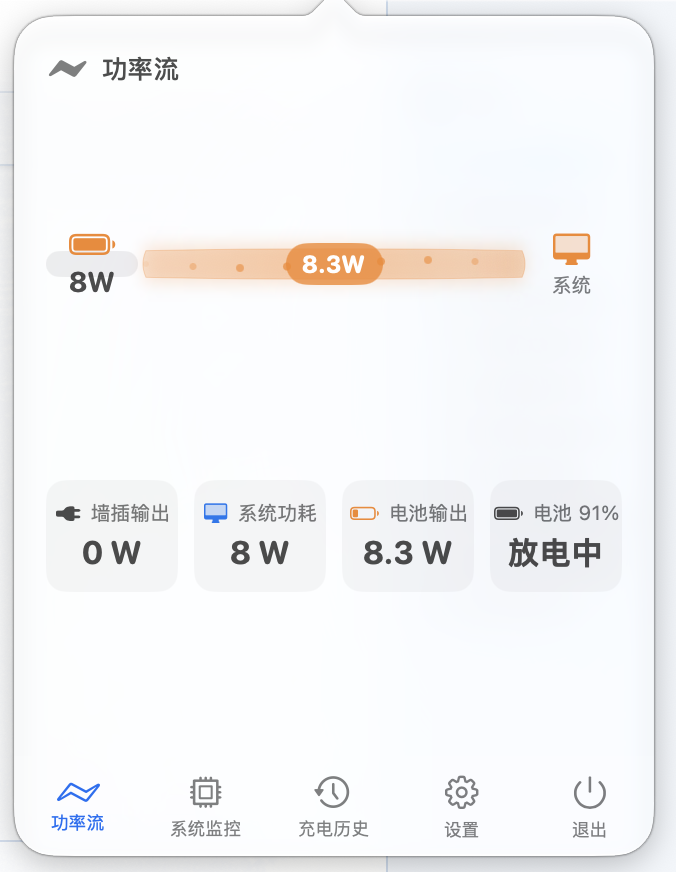
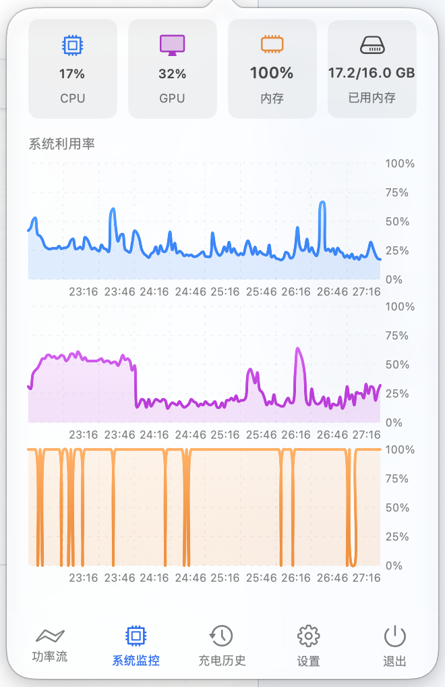
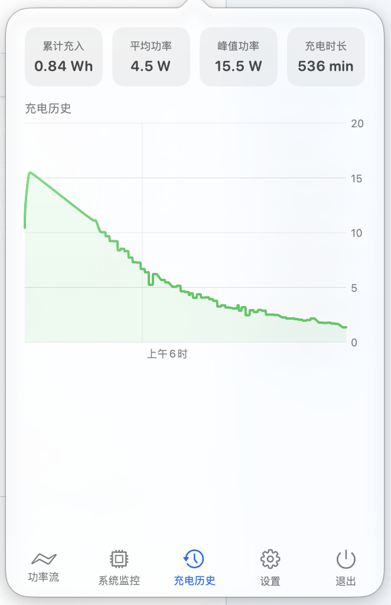

<p align="center">
  <strong>⚡ PowerPulse</strong><br>
  <em>macOS menu bar power & system monitor</em><br>
  <em>macOS 菜单栏电源 & 系统监控工具</em>
</p>

<p align="center">
  
  
  
  <a href="https://777cola.github.io/PowerPulse/"></a>
</p>

---

<p align="center">
  
  &nbsp;&nbsp;
  
  &nbsp;&nbsp;
  
</p>

<p align="center">
  🔗 <strong>Showcase Website / 展示网站：</strong><a href="https://777cola.github.io/PowerPulse/">777cola.github.io/PowerPulse</a>
</p>

## Features / 功能特性

### Menu Bar / 菜单栏

- Real-time wattage display with tabular (monospace) digits — no layout shift
- Battery percentage + mini battery icon
- Color-coded status bar icon by power state:

| State | Color | Icon |
|-------|-------|------|
| Charging | 🟢 Green | Battery + ⚡ bolt |
| Plugged in, not charging | 🟣 Purple | Battery only |
| On battery (normal) | ⚪ White | Battery only |
| On battery (< 15%) | 🔴 Red | Battery only |

---

- 实时显示当前功率，等宽数字避免跳动
- 电池百分比 + 迷你电池图标
- 状态栏电池图标根据电源状态变色：充电中🟢（带闪电）、已接电源🟣、电池正常⚪、低电量🔴

### Power Panel / 电源面板

- Battery in/out wattage
- Charger rated wattage
- System total power draw
- Battery percentage with visual gauge
- Charger name & specs (V/A)
- Real-time power chart (last 60s, 2s sample rate)

---

- 充放电功率实时显示
- 充电器额定功率
- 系统总功耗
- 电池百分比 + 可视化进度条
- 充电器名称及规格（电压/电流）
- 实时功率曲线图（最近 60 秒，2 秒采样）

### System Monitor / 系统监控

- CPU usage (per-core average)
- GPU usage (via IORegistry / Metal)
- Memory usage (used / total in GB)
- 5-minute history charts for each metric
- 2-second refresh rate, ~150 sample buffer

---

- CPU 使用率（多核平均）
- GPU 使用率（通过 IORegistry / Metal 获取）
- 内存使用量（已用 / 总计，GB）
- 每项指标独立 5 分钟历史图表
- 2 秒刷新，约 150 个采样点缓冲

### History & Export / 历史与导出

- Cumulative charge (Wh), average/peak power, charge duration
- Export charging data to CSV

---

- 累计充电量（Wh）、平均/峰值功率、充电时长
- 支持导出充电数据为 CSV

## Requirements / 系统要求

- macOS 14.0 (Sonoma) or later
- Swift 6.3+ (Xcode 16+)

---

- macOS 14.0 (Sonoma) 或更高版本
- Swift 6.3+（Xcode 16+）

## Install / 安装

Download `PowerPulse-Installer.dmg` from [Releases](https://github.com/777cola/PowerPulse/releases), open it and drag PowerPulse to Applications.

从 [Releases](https://github.com/777cola/PowerPulse/releases) 下载 `PowerPulse-Installer.dmg`，双击打开，将 PowerPulse 拖入 Applications 文件夹即可。


## Build from Source / 从源码构建

```bash
git clone https://github.com/777cola/PowerPulse.git
cd PowerPulse
./build_app.sh
```

### Create DMG Installer / 创建安装包

```bash
./create_dmg.sh
```

Generates `PowerPulse-Installer.dmg` for distribution.
生成 `PowerPulse-Installer.dmg` 用于分发。

## Project Structure / 项目结构

```
PowerPulse/
├── Package.swift                 # SPM configuration
├── build_app.sh                  # Build script
├── create_dmg.sh                 # DMG packaging script
├── PowerPulse/
│   ├── ChargeWatchApp.swift      # App entry + AppDelegate
│   ├── BatteryMonitor.swift      # IOKit battery data
│   ├── PowerHistoryStore.swift   # Historical data persistence
│   ├── PowerFlowView.swift       # Power flow visualization
│   ├── Models.swift              # Data models
│   ├── Charts.swift              # Chart components
│   ├── LivePanelView.swift       # Main panel UI
│   ├── Appearance.swift          # Theme system
│   ├── SystemMonitor.swift       # CPU/GPU/Memory data collection
│   └── SystemMonitorView.swift   # System monitor UI & charts
├── docs/
│   └── index.html                # Showcase website (GitHub Pages)
├── screenshots/
├── LICENSE
└── README.md
```

## Technical Details / 技术细节

| Component | API | 说明 |
|-----------|-----|------|
| Battery data | IOKit (AppleSmartBattery) | 电池数据 |
| CPU usage | `host_processor_info()` | CPU 使用率 |
| GPU usage | IORegistry (IOAccelerator PerformanceStatistics) | GPU 使用率 |
| Memory | `host_statistics64()` | 内存使用 |
| UI | SwiftUI + AppKit | 界面框架 |
| Charts | Swift Charts | 图表组件 |
| Theme | NSVisualEffectView (frosted glass) | 毛玻璃主题 |

## License / 开源协议

[MIT](LICENSE) © [AutumnPants](https://github.com/777cola)
